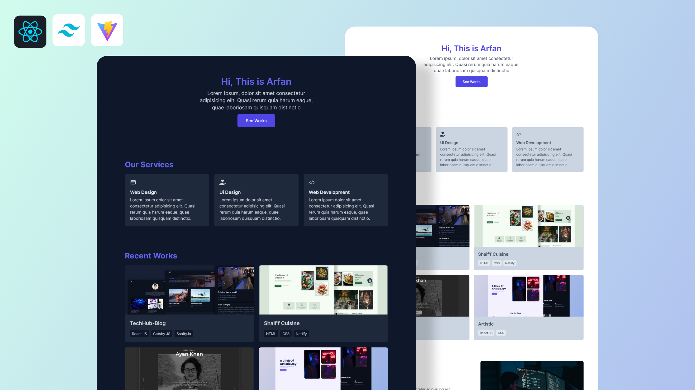

## React Tailwind Portfolio

A simple responsive portfolio website with `dark mode` feature.

**Live Preview:https://react-tailwind-portfolio.surge.sh/**

**Watch on Youtube: [https://youtu.be/QTY2fLpQn44][yt-video]**

---

### Made with ❤️ by [Shaif Arfan][arfan-ig]

Like my works and want to support me?

---

Technologies used:

- [React](https://reactjs.org/)
- [Tailwind CSS](https://tailwindcss.com/)
- [Vite.JS](https://vitejs.org/)

## Other projects

📚 [All Web Cifar Projects][wc-projects]

## FAQ

### Q: How can i get started?

You can get started by following the YouTube tutorial of this project. Here is the full tutorial video link: [YouTube Video][yt-video].

### Q: I can use this project for my website?

Yes you can. It absolutely free to use. If you want to support the project, you can [buy me a coffee][buymeacoffee].

## Feedback

If you have any feedback, please reach out to us at [@web_cifar][wc-tw]

## Support

For support, join our [Community Group][wc-fb-group].

## License

[MIT][mit]

Happy Coding! ✨🚀

[wc-tw]: http://twitter.com/webcifar
[wc-yt]: http://www.youtube.com/webcifarOfficial
[arfan-ig]: https://www.instagram.com/shaifarfan08/
[wc-projects]: https://github.com/ShaifArfan/wc-project-tutorials
[wc-fb-group]: https://www.facebook.com/groups/webcifar
[mit]: https://choosealicense.com/licenses/mit/
[yt-video]: https://youtu.be/QTY2fLpQn44
[buymeacoffee]: https://www.buymeacoffee.com/shaifarfan08
